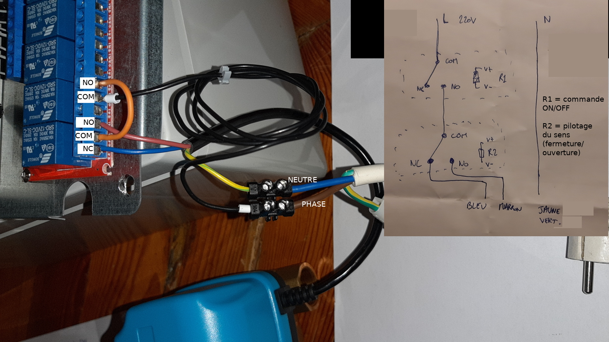

On travaille avec un raspberry, pas avec un arduino. On n'est pas à la recherche de performances temps réel.

http://gilles.thebault.free.fr/spip.php?article44

https://github.com/WiringPi/WiringPi-Python

Il faut avoir installé wiringPi

```
pip3 install wiringpi
```

# pilotage des actionneurs d'un circuit de chauffage

## montage en mode mélange



[code](src/relay2.py)

```
wget https://raw.githubusercontent.com/alexjunk/GTCworkout/main/src/relay2.py
```
## des bidouilleurs le font

http://sarakha63-domotique.fr/jeedom-domotiser-une-vanne-3-voies/

# PID - contrôle temps réel

https://github.com/imax9000/Arduino-PID-Library

http://brettbeauregard.com/blog/2011/04/improving-the-beginners-pid-introduction/

https://www.abcclim.net/regulation-p-pi-pid.html

http://www.ferdinandpiette.com/blog/2011/08/implementer-un-pid-sans-faire-de-calculs/

[doc sur les régulateurs P, PI et PID](regulateurs_standards.pdf)

# culture G

[vers la maison passive](https://trystanlea.org.uk/)


