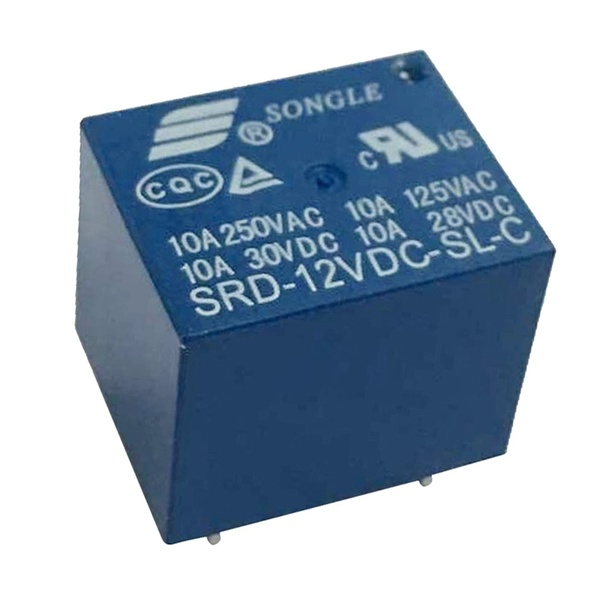
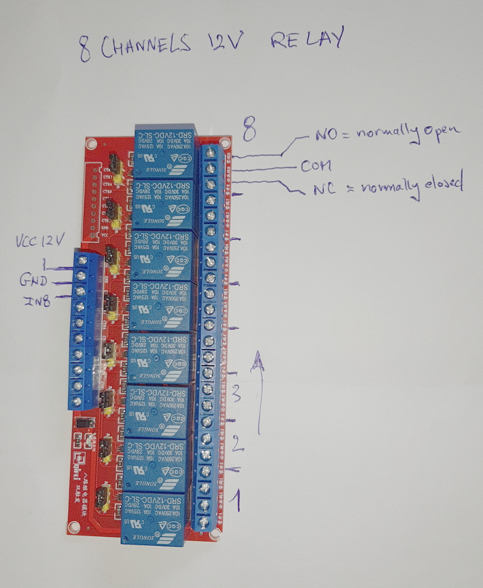
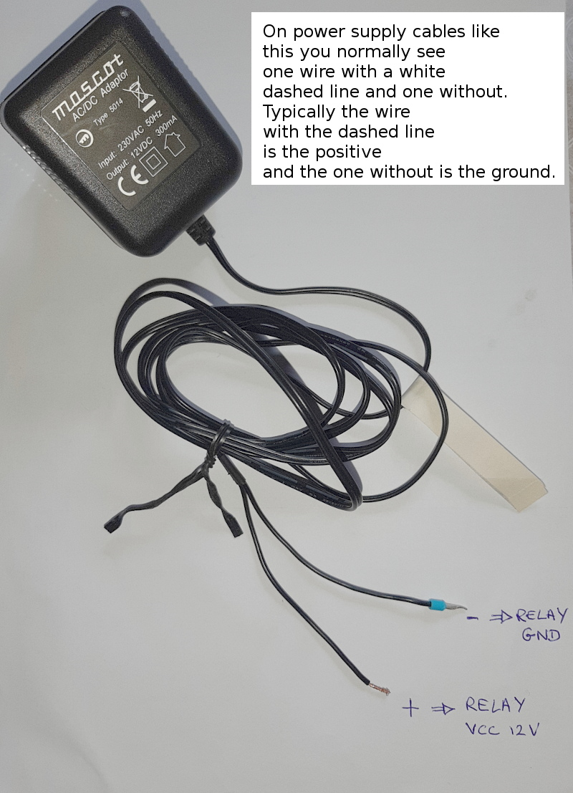
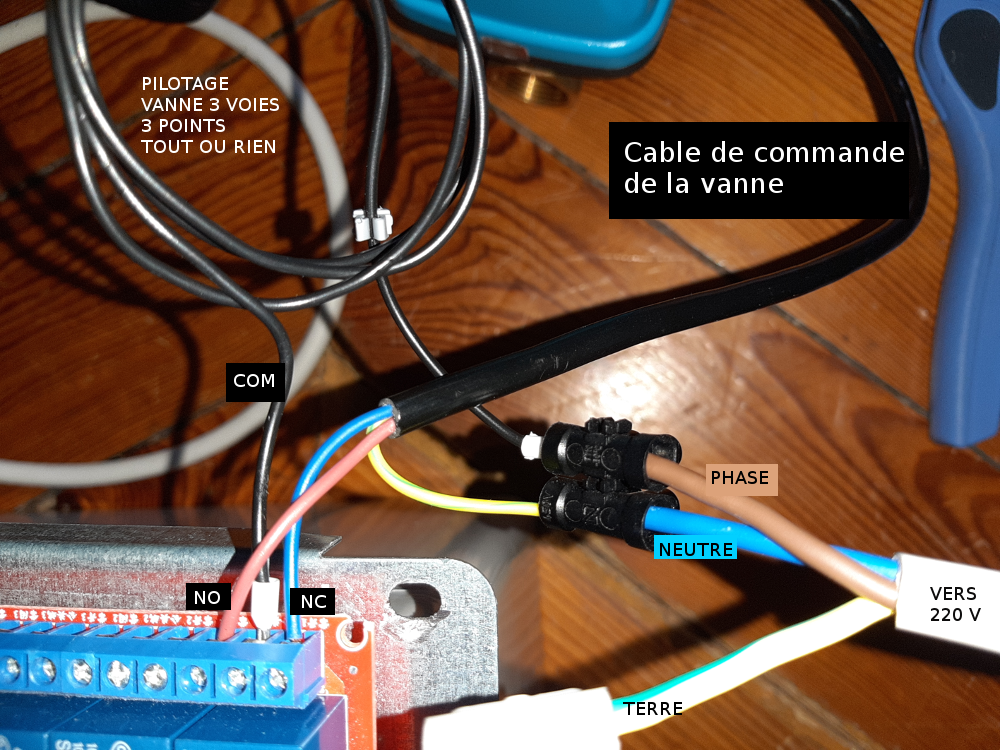

# how to operate relays

Le relais s’alimente et se commande en 12V (SRD-12VDC-SL-C)

Ce type de relais supporte :

- 10 ampères sous 250V alternatif (50 ou 60Hz), c’est-à-dire du secteur en France.
- 10 ampères sous 125V alternatif (50 ou 60Hz), c’est-à-dire environ 1KW pour les pays en 110V. 
- 10 ampères en 28 ou 30V continu.

Cela permet de commander un appareil jusqu’à environ 2KW, soit une ampoule ou un radiateur. 

Attention aux moteurs qui ont souvent un très fort appel de courant au démarrage :

- Impossible de brancher la machine à laver ou le frigo sur ce genre de relais. 
- Il semble possible de contrôler un ventilateur dont le moteur fait quelques dizaines de watt.

Une première initiation pour [commander une lampe](relays_operate_a_lamp.md)

## relays

Connection d'une vanne 3 voies 3 points TOR (le mélange est tout ou rien). Lorsque la bobine du relay n'est pas alimenté, la vanne est totalement fermée. Lorsque la bobine du relay est alimentée, la vanne est totalement ouverte.

Pour les vannes 3 voies 3 points dont on peut régler le mélange sur des positions intermédiaires, il faut 2 relays, un pour commander la commande ON/OFF avec un timer, l'autre pour commander le sens (ouverture/fermeture). 
Si `c` est la course de la vanne (en s ou ms), on applique la commande 0.2/0.5/0.8 fois `c` pour s'arrêter en position intermédiaire et produire un mélange particulier. C'est utile pour le hors-gel notamment. 

## raspberry control

To check pinout on the raspberry : https://pinout.xyz/#

