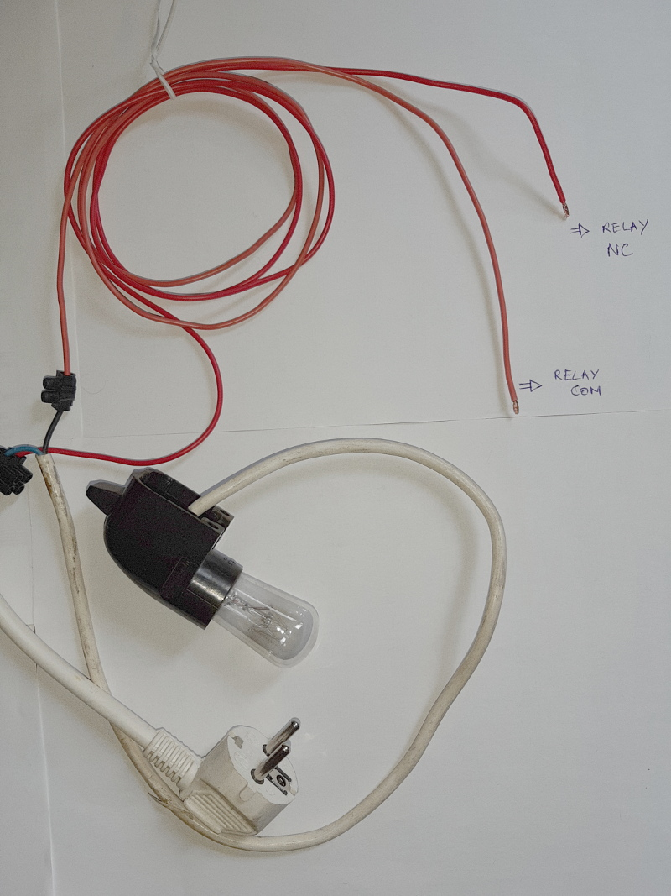

# operate a lamp with a relay





## raspberry control


To check pinout on the raspberry : https://pinout.xyz/#

```
import RPi.GPIO as GPIO
import curses

GPIO.setmode(GPIO.BCM)

nb=26

GPIO.setup(nb, GPIO.OUT)
GPIO.output(nb, GPIO.HIGH)

stdscr = curses.initscr()
curses.noecho()
curses.cbreak()
stdscr.addstr(0,0, "a=allumer s=stop q=quitter")

while True:
    c = stdscr.getch()
    if c == ord('a'):
        GPIO.output(nb, GPIO.HIGH)
    if c == ord('s'):
        GPIO.output(nb, GPIO.LOW)
    if c == ord('q'):
        curses.nocbreak()
        stdscr.keypad(False)
        curses.echo()
        curses.endwin()
        GPIO.cleanup()
        break
```
more about curses : https://docs.python.org/3/howto/curses.html

more about RPi.GPIO : https://pypi.org/project/RPi.GPIO/

Note that RPi.GPIO is unsuitable for real-time or timing critical applications. This is because you can not predict when Python will be busy garbage collecting. It also runs under the Linux kernel which is not suitable for real time applications - it is multitasking O/S and another process may be given priority over the CPU, causing jitter in your program. If you are after true real-time performance and predictability, buy yourself an Arduino

https://raspberrypi.pagesperso-orange.fr/dossiers/26-33.htm
