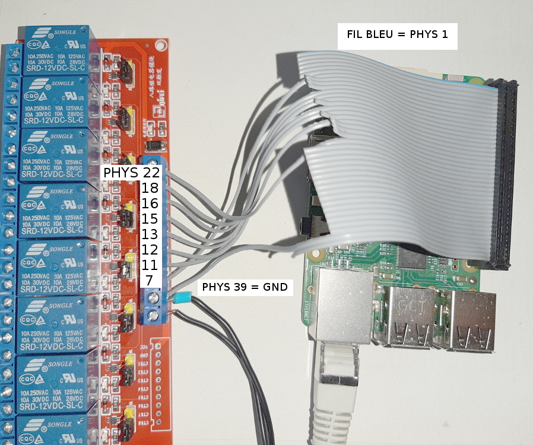

# utilisation d'une nappe ATA

Sur la nappe, vous remarquerez qu'un fil est différent des autres de par sa couleur. Ce fil est le fil 1 correspondant au connecteur 1 de la broche.

## broche ATA parallèle - vue de dessous


## le module de relais, la nappe vue de dessus et le raspberry



wiringPi|physical|BCM|Relay
--|--|--|--
7 | 7| 4| 8
0 |11|17| 7
1 |12|18| 6
2 |13|27| 5
3 |15|22| 4
4 |16|23| 3
5 |18|24| 2
6 |22|25| 1


```
$ gpio mode 7 out
$ gpio write 7 1
$ gpio write 7 0

$ gpio mode 6 out
$ gpio write 6 1
$ gpio write 6 0

$ gpio mode 5 out
$ gpio write 5 0
$ gpio write 5 1
```
